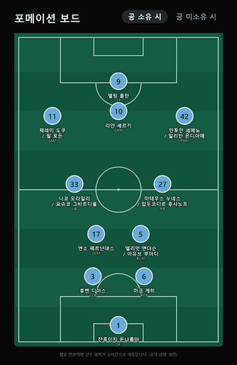

# Tactics Board — 해외축구 전술 분석 웹앱


포메이션별로 해당 전술을 사용하는 팀과 감독을 탐색하고, 팀 상세 페이지에서 공 소유/미소유 시 포메이션 변화를 2D 핏치 보드로 확인할 수 있는 웹 서비스입니다.

**배포 링크: https://tactics-board-cyan.vercel.app**

## 데모



탭을 전환하면 같은 11명이 공 소유 시 대형과 미소유 시 대형 사이를 이동합니다. 위 예시는 맨체스터 시티로, 공을 잡으면 왼쪽 풀백이 안쪽으로 접혀 백3를 만들고 전방 5명이 넓게 펼쳐지는 구조가 드러납니다.

## 주요 기능

- **포메이션 선택 및 팀 리스트업**: 4-3-3, 4-2-3-1, 3-4-2-1, 4-4-2, 3-5-2, 5-3-2, 4-3-1-2 등 포메이션별 필터, 팀명·리그·감독명 검색 및 정렬, 카드/테이블 뷰 전환
- **팀 상세 페이지**: 감독·포메이션 요약, 공 소유 시/미소유 시 전술 설명, 핵심 선수 및 전술적 역할, 관전 포인트
- **포메이션 보드**: 축구장 배경 위에 등번호·이름이 표시된 선수 토큰을 배치하고, 공 소유/미소유 탭 전환 시 선수 위치가 실시간으로 이동
- **구단 엠블럼**: 29개 클럽의 실제 엠블럼 이미지를 통일된 크기로 표시

현재 프리미어리그 주요 클럽, 라리가·세리에A·분데스리가·리그앙 주요 클럽, 그리고 한국 선수들이 소속된 해외 클럽까지 총 29개 팀의 감독·선발 명단·전술 데이터를 다루고 있습니다. 데이터는 웹 리서치를 기반으로 하며, 이적/감독 교체 등에 따라 실제와 달라질 수 있습니다.

선발 명단은 **정상 컨디션 기준 주전 서열**로 적습니다. 즉 부상으로 잠시 빠진 선수를 후보로 내리지 않고, 로테이션 경쟁이 실제로 있는 자리만 `주전 / 경쟁 선수` 형태로 함께 표기합니다.

## 기술 스택

- **프레임워크**: Next.js 16 (App Router) + TypeScript
- **스타일링**: Tailwind CSS v4
- **시각화**: 별도 라이브러리 없이 순수 SVG로 구현한 포메이션 보드
- **데이터**: `src/data`에 정의된 TypeScript 기반 구조화 데이터(Formation, Team, TacticalDetail, PitchCoordinate)

## 프로젝트 구조

```
src/
├── app/                      # 라우트 (홈, 팀 상세)
├── components/
│   ├── formation/            # 포메이션 필터
│   ├── team/                 # 팀 카드/테이블/배지
│   ├── home/                 # 홈 화면 오케스트레이터
│   ├── pitch/                # SVG 포메이션 보드
│   ├── team-detail/          # 팀 상세 페이지 섹션
│   └── layout/                # 헤더/푸터
├── data/                     # 포메이션·팀·좌표 템플릿 데이터
├── lib/                      # 필터/정렬, 선수 명단 빌더
└── types/                    # 도메인 타입 정의
public/badges/                # 구단 엠블럼 이미지
```

## 시작하기

```bash
npm install
npm run dev
```

[http://localhost:3000](http://localhost:3000) 에서 확인할 수 있습니다.

빌드 및 타입 체크:

```bash
npm run build
```

## 배포

[Vercel](https://vercel.com)에 배포되어 있으며, `main`/`master` 브랜치에 변경 사항을 반영한 뒤 `vercel --prod`로 재배포할 수 있습니다.

## 라이선스

이 저장소의 소스 코드는 [MIT License](LICENSE)를 따릅니다.

단, `public/badges/`의 구단 엠블럼은 예외입니다. 각 구단이 권리를 보유한 상표이며 식별 목적으로만 포함했습니다. MIT 라이선스가 적용되지 않으므로, 포크해서 사용하실 때는 직접 권리 관계를 확인하시기 바랍니다.
